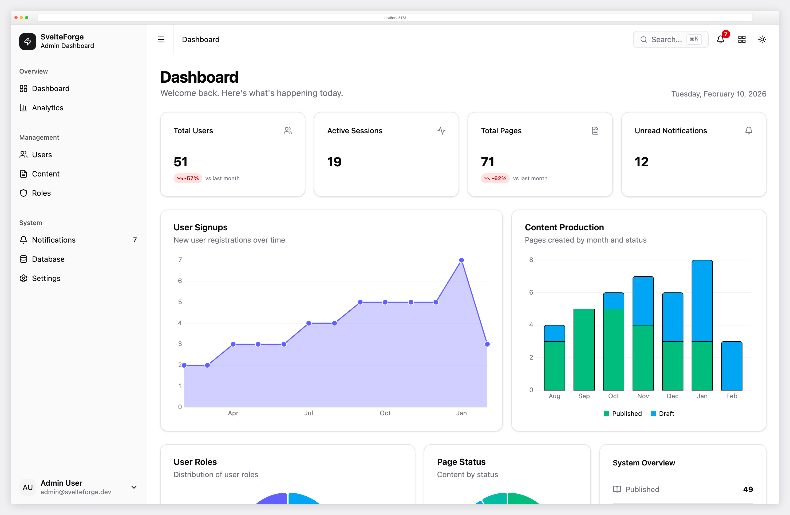
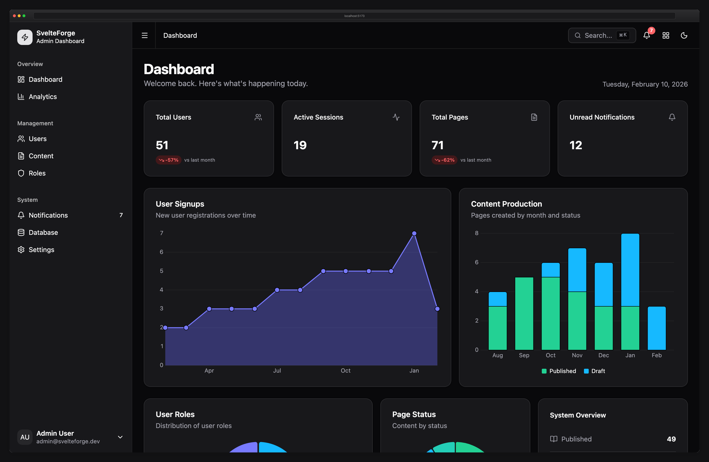
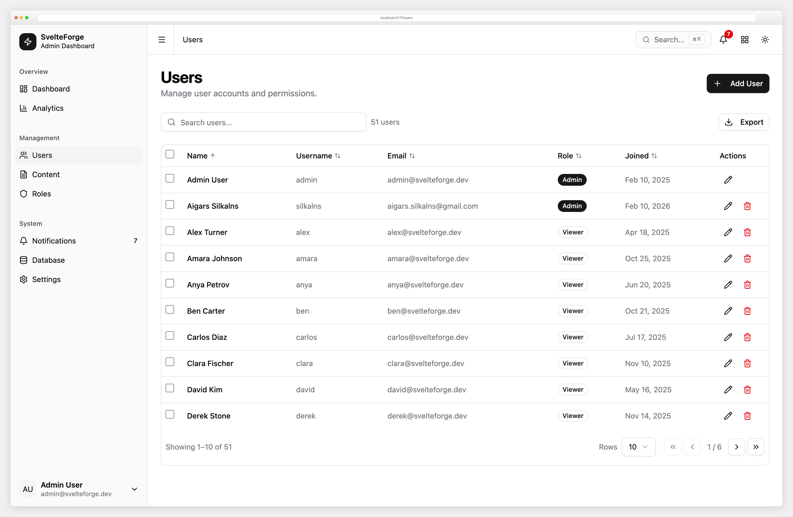
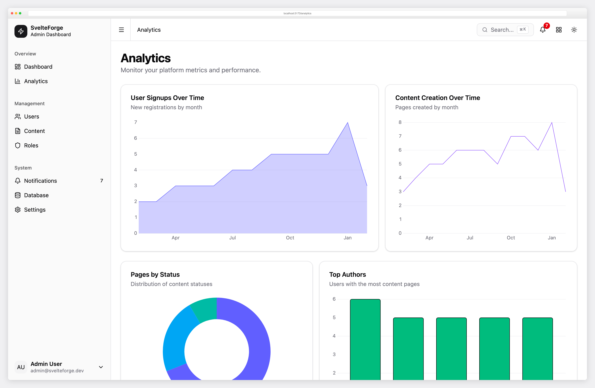
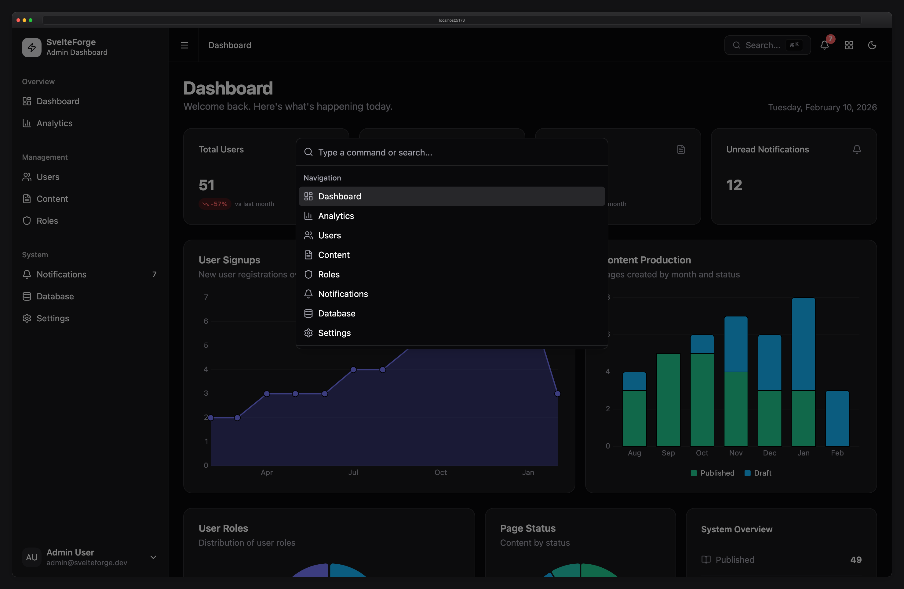
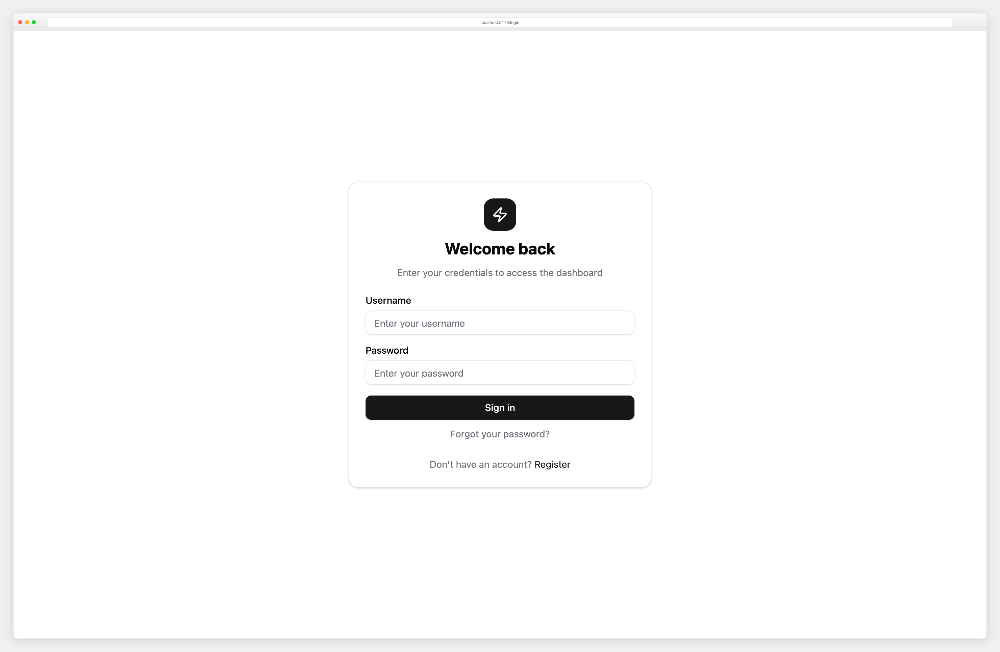
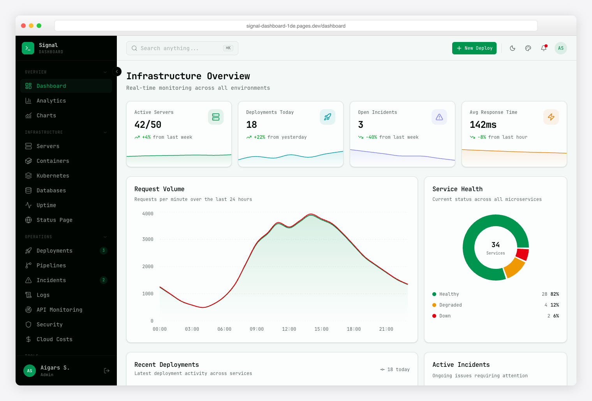
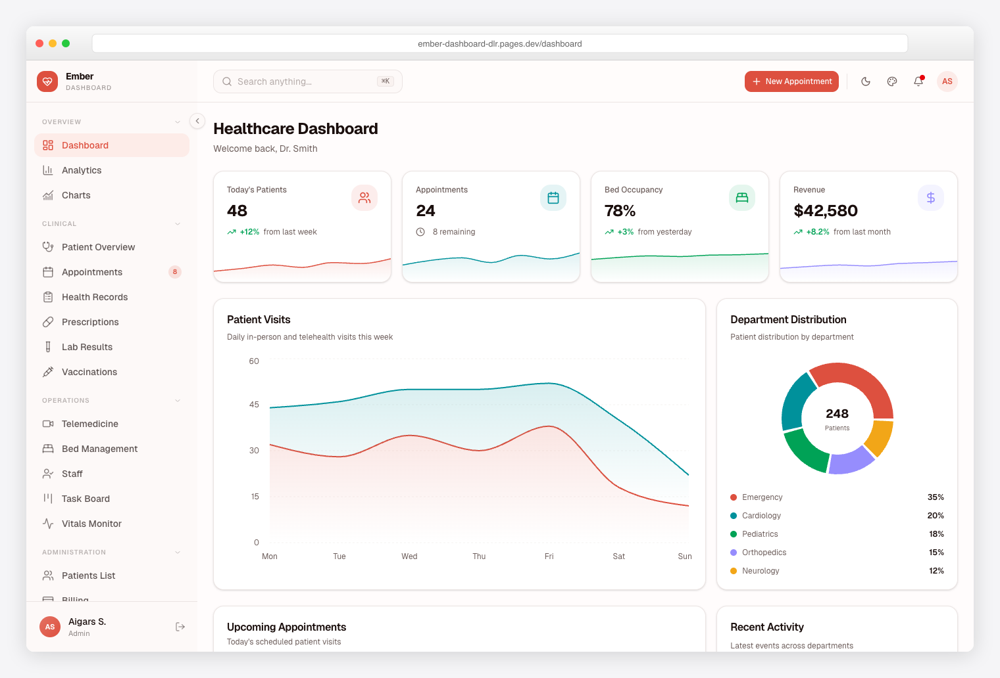
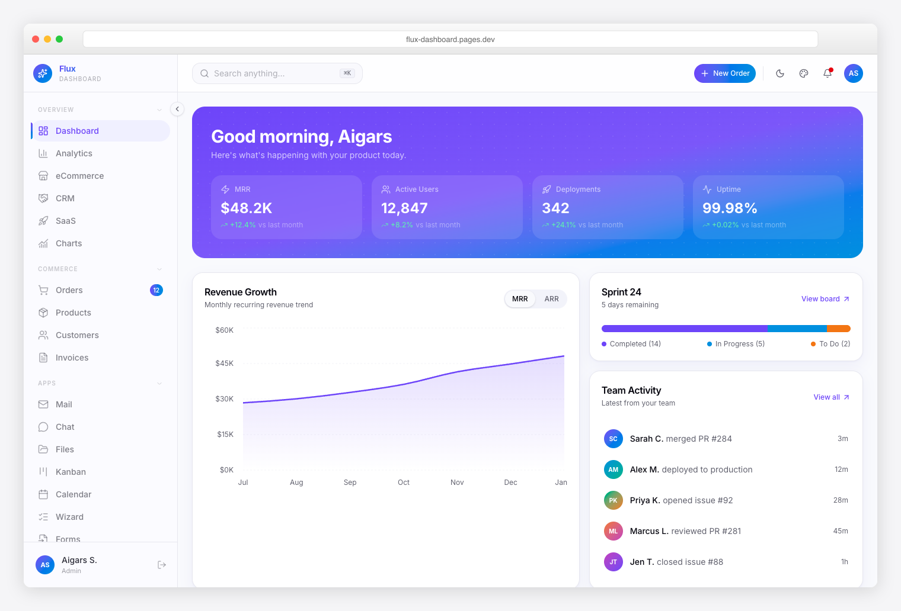

# SvelteForge - SvelteKit Admin Dashboard Template

A production-ready admin dashboard template built with **SvelteKit 2**, **Svelte 5**, **Tailwind CSS 4**, and **Supabase** (Postgres + Auth). Features Supabase-backed authentication, optional OAuth (Google & GitHub), role-based access control, and a full suite of admin tools.


## Screenshots

<table>
  <tr>
    <td align="center"><strong>Dashboard (Light)</strong></td>
    <td align="center"><strong>Dashboard (Dark)</strong></td>
  </tr>
  <tr>
    <td></td>
    <td></td>
  </tr>
  <tr>
    <td align="center"><strong>User Management</strong></td>
    <td align="center"><strong>Analytics</strong></td>
  </tr>
  <tr>
    <td></td>
    <td></td>
  </tr>
  <tr>
    <td align="center"><strong>Command Palette (Cmd+K)</strong></td>
    <td align="center"><strong>Login</strong></td>
  </tr>
  <tr>
    <td></td>
    <td></td>
  </tr>
</table>

---

## Premium Dashboards from DashboardPack

Loved SvelteForge? Supercharge your workflow with our premium templates on [DashboardPack](https://dashboardpack.com/?utm_source=github&utm_medium=readme&utm_campaign=svelteforge) -- built for production, backed by dedicated support.

<table>
  <tr>
    <td align="center" width="33%">
      <a href="https://dashboardpack.com/theme-details/apex-nextjs/?utm_source=github&utm_medium=readme&utm_campaign=svelteforge">
        
      </a>
      <br>
      <a href="https://dashboardpack.com/theme-details/apex-nextjs/?utm_source=github&utm_medium=readme&utm_campaign=svelteforge"><strong>Apex</strong></a>
      <br>
      <sub>Next.js 16 + React 19 + Tailwind CSS v4. 50+ pages, full CRUD, live theme customizer, 5 dashboards.</sub>
    </td>
    <td align="center" width="33%">
      <a href="https://dashboardpack.com/theme-details/zenith-nextjs/?utm_source=github&utm_medium=readme&utm_campaign=svelteforge">
        
      </a>
      <br>
      <a href="https://dashboardpack.com/theme-details/zenith-nextjs/?utm_source=github&utm_medium=readme&utm_campaign=svelteforge"><strong>Zenith</strong></a>
      <br>
      <sub>Next.js 16 + React 19 + Tailwind CSS v4. Achromatic design, drag-and-drop, i18n, RTL support.</sub>
    </td>
    <td align="center" width="33%">
      <a href="https://dashboardpack.com/theme-details/signal-nextjs/?utm_source=github&utm_medium=readme&utm_campaign=svelteforge">
        
      </a>
      <br>
      <a href="https://dashboardpack.com/theme-details/signal-nextjs/?utm_source=github&utm_medium=readme&utm_campaign=svelteforge"><strong>Signal</strong></a>
      <br>
      <sub>Next.js 16 + React 19 + Tailwind CSS v4. 10 chart types, Storybook, 3 layout options.</sub>
    </td>
  </tr>
  <tr>
    <td align="center" width="33%">
      <a href="https://dashboardpack.com/theme-details/ember-nextjs/?utm_source=github&utm_medium=readme&utm_campaign=svelteforge">
        
      </a>
      <br>
      <a href="https://dashboardpack.com/theme-details/ember-nextjs/?utm_source=github&utm_medium=readme&utm_campaign=svelteforge"><strong>Ember</strong></a>
      <br>
      <sub>Next.js 16 + React 19 + Tailwind CSS v4. Clean minimal design, Kanban, Calendar, Chat.</sub>
    </td>
    <td align="center" width="33%">
      <a href="https://dashboardpack.com/theme-details/flux-nextjs/?utm_source=github&utm_medium=readme&utm_campaign=svelteforge">
        
      </a>
      <br>
      <a href="https://dashboardpack.com/theme-details/flux-nextjs/?utm_source=github&utm_medium=readme&utm_campaign=svelteforge"><strong>Flux</strong></a>
      <br>
      <sub>Next.js 16 + React 19 + Tailwind CSS v4. Gradient design, frosted glass UI, startup-native data.</sub>
    </td>
    <td align="center" width="33%">
      <a href="https://dashboardpack.com/theme-details/admindek-html/?utm_source=github&utm_medium=readme&utm_campaign=svelteforge">
        
      </a>
      <br>
      <a href="https://dashboardpack.com/theme-details/admindek-html/?utm_source=github&utm_medium=readme&utm_campaign=svelteforge"><strong>Admindek</strong></a>
      <br>
      <sub>Bootstrap 5 + vanilla JS. 100+ components, theme customizer, RTL, 10 color palettes.</sub>
    </td>
  </tr>
</table>

<p align="center">
  <a href="https://dashboardpack.com/?utm_source=github&utm_medium=readme&utm_campaign=svelteforge"><strong>Browse All Premium Templates on DashboardPack</strong></a>
</p>

---

## Tech Stack

| Layer | Technology |
| --- | --- |
| **Framework** | SvelteKit 2.50 + Svelte 5 (runes API) |
| **Styling** | Tailwind CSS 4 + shadcn-svelte |
| **Database** | Supabase Postgres (`@supabase/ssr` + service role on the server) |
| **Auth** | Custom sessions (@oslojs/crypto) + Argon2id password hashing |
| **OAuth** | Arctic (Google + GitHub) -- optional, environment-driven |
| **Charts** | LayerChart v2 (D3-based) |
| **Testing** | Vitest (unit) + Playwright (E2E) |
| **Linting** | ESLint 9 + Prettier |

---

## Features

### Authentication & Security

- **Supabase Auth** -- Email/password sign-up and sign-in with SSR session handling via `@supabase/ssr`.
- **App profiles** -- Rows in `public.users` linked to `auth.users`; roles stored for RBAC inside the admin app.
- **OAuth login (optional)** -- Google and GitHub via Arctic when credentials are present in `.env`.
- **Password reset** -- Uses Supabase Auth recovery flows where configured.
- **Screen lock** -- Lock screen that requires signing in again when unlocked.

### Role-Based Access Control (RBAC)

Three built-in roles with different permission levels:

| Role | Capabilities |
| --- | --- |
| **Admin** | Full access -- manage users, change roles, delete accounts, access all settings |
| **Editor** | Create and manage content, view analytics and notifications |
| **Viewer** | Read-only access to dashboard and content |

- First registered user automatically gets the `admin` role.
- Admins can promote/demote users between roles.
- Role-change confirmation dialogs prevent accidental modifications.

### Dashboard

- **KPI cards** -- Total users, active sessions, published pages, and unread notifications with change indicators.
- **Interactive charts** -- Area charts (user registrations over time), bar charts (content by status), pie/donut charts (users by role) powered by LayerChart v2.
- **Recent activity feed** -- Latest user registrations and content updates.
- **Animated counters** -- Dashboard numbers animate from zero on load with easeOutExpo easing.

### User Management

- **Full CRUD operations** -- Create, view, edit, and delete users.
- **Server-side data table** -- Sortable columns, search filtering, pagination with configurable page sizes.
- **Bulk actions** -- Delete confirmation dialogs with clear warnings.
- **User creation dialog** -- Admin-only form to create new users with role assignment.
- **Export** -- Download user data as CSV or JSON.

### Content Management (CMS)

- **Page editor** -- Create and edit pages with title, slug, content, and template selection.
- **Templates** -- Default, Landing, and Blog page templates.
- **Publishing workflow** -- Draft / Published / Archived status transitions.
- **Auto-generated slugs** -- Slugs generated from titles, editable before save.
- **Content table** -- Filterable by status, sortable, with pagination.
- **Export** -- Download content data as CSV or JSON.

### Analytics

- **User growth charts** -- Line/area charts showing registration trends over time.
- **Content breakdown** -- Bar and pie charts showing content distribution by status and template.
- **Session analytics** -- Active session counts and trends.
- **Notification metrics** -- Read vs. unread notification ratios.
- **Tabbed interface** -- Separate tabs for Users, Content, Sessions, and Notifications analytics.

### Notifications

- **In-app notification system** -- Info, warning, error, and success notification types.
- **Notification bell** -- Real-time unread count badge in the top navigation bar.
- **Notification popover** -- Quick preview of recent notifications without leaving the current page.
- **Full notifications page** -- View all notifications with mark-as-read and delete actions.
- **Bulk operations** -- Mark all as read, delete all read notifications.

### Role Management

- **Role overview** -- View all roles with member counts and permission summaries.
- **Role-change dialogs** -- Confirmation dialogs when changing user roles.
- **Permission matrix** -- Visual display of what each role can do.

### Database Management

- **Table browser** -- View all database tables with row counts.
- **Schema viewer** -- Inspect table schemas including column names, types, and constraints.
- **Data export** -- Export any table's data as CSV or JSON.
- **Admin-only access** -- Database management restricted to admin role.

### Settings

- **Profile settings** -- Update display name, email, and avatar URL.
- **Password change** -- Change password with current password verification.
- **Session management** -- View all active sessions with device info, IP addresses, and last activity. Revoke individual sessions or all other sessions.
- **App settings** -- Configurable application-level settings stored in the database.
- **Appearance** -- Dark/light mode toggle with system preference detection (persisted via mode-watcher).

### Additional Features

- **Command palette (Cmd+K)** -- Keyboard-driven command palette with navigation, live search, and quick actions (toggle theme, create page).
- **Page view transitions** -- Smooth cross-fade between pages via the View Transitions API.
- **Responsive design** -- Fully responsive layout with collapsible sidebar on mobile.
- **Dark/light mode** -- System-aware theme with manual toggle, persisted across sessions.
- **Breadcrumb navigation** -- Auto-generated breadcrumbs from URL pathname.
- **Apps menu** -- Quick-access grid menu for jumping between sections.
- **Toast notifications** -- Svelte Sonner for action feedback (success, error, info).
- **SEO ready** -- OpenGraph and Twitter meta tags via svelte-meta-tags.
- **Sitemap** -- Auto-generated XML sitemap endpoint.
- **Error page** -- Custom error page with navigation back to safety.
- **Data table pagination** -- Reusable pagination component with page size selector.

---

## Quick Start

### Prerequisites

- **Node.js** 18+ (20+ recommended)
- **pnpm** (install via `npm install -g pnpm`)

### Installation

```bash
# Clone the repository
git clone https://github.com/colorlibhq/svelteforge-admin.git
cd svelteforge-admin

# Install dependencies
pnpm install

# Configure environment (copy .env.example → .env; set Supabase URL, keys, and DATABASE_URL as documented there)

# Apply the SQL schema once in the Supabase SQL Editor (see scratch/supabase_schema.sql)

# Start the development server
pnpm dev
```

The app will be running at `http://localhost:5173`.

### First account

Register at `/register` after the database schema exists in Supabase. The **first** user created in `public.users` is assigned the **`admin`** role; later registrations default to **`viewer`** until you change roles in the app.

---

## OAuth Setup (Optional)

Social login is entirely optional. When no OAuth credentials are configured, the login page shows only the username/password form -- no errors, no broken buttons.

### Google

1. Go to [Google Cloud Console](https://console.cloud.google.com/apis/credentials)
2. Create a new OAuth 2.0 Client ID
3. Set the authorized redirect URI to: `http://localhost:5173/login/google/callback`
4. Add your credentials to `.env`:

```env
GOOGLE_CLIENT_ID=your-client-id
GOOGLE_CLIENT_SECRET=your-client-secret
```

### GitHub

1. Go to [GitHub Developer Settings](https://github.com/settings/developers)
2. Create a new OAuth App
3. Set the authorization callback URL to: `http://localhost:5173/login/github/callback`
4. Add your credentials to `.env`:

```env
GITHUB_CLIENT_ID=your-client-id
GITHUB_CLIENT_SECRET=your-client-secret
```

### Production

For production, update the `ORIGIN` environment variable to match your deployed URL:

```env
ORIGIN=https://yourdomain.com
```

Redirect URIs in your OAuth apps must also be updated to use the production URL.

---

## Commands

```bash
# Development
pnpm dev              # Start dev server (http://localhost:5173)
pnpm build            # Production build
pnpm preview          # Preview production build

# Type Checking
pnpm check            # Type-check with svelte-check
pnpm check:watch      # Type-check in watch mode

# Testing
pnpm test             # Run unit tests (Vitest)
pnpm test:watch       # Run tests in watch mode
pnpm test:e2e         # Run E2E tests (Playwright)

# Code Quality
pnpm lint             # Run ESLint
pnpm format           # Format code with Prettier
pnpm format:check     # Check formatting without writing
```

---

## Project Structure

```text
src/
├── app.css                          # Tailwind CSS 4 theme (OKLCH colors)
├── app.d.ts                         # TypeScript type definitions
├── hooks.server.ts                  # Session validation on every request
├── lib/
│   ├── assets/                      # Static assets (favicon)
│   ├── components/
│   │   ├── ui/                      # shadcn-svelte components
│   │   ├── animated-counter.svelte   # Animated number counter (KPI cards)
│   │   ├── app-sidebar.svelte       # Main navigation sidebar
│   │   ├── apps-menu.svelte         # Quick-access grid menu
│   │   ├── command-palette.svelte   # Cmd+K command palette
│   │   ├── data-table-pagination.svelte
│   │   ├── delete-confirm-dialog.svelte
│   │   ├── notification-bell.svelte # Notification badge + popover
│   │   ├── role-change-dialog.svelte
│   │   ├── theme-toggle.svelte      # Dark/light mode toggle
│   │   └── user-form-dialog.svelte  # Create/edit user form
│   ├── hooks/                       # Svelte 5 reactive utilities
│   ├── server/
│   │   ├── auth.ts                  # Load app user profile from Supabase
│   │   ├── supabase-admin.ts       # Service-role Supabase client (server-only)
│   │   ├── id.ts                    # Crypto ID generator
│   │   └── oauth.ts                 # Arctic OAuth providers (Google, GitHub)
│   └── utils/
│       ├── export.ts                # CSV/JSON export utilities
│       └── user-agent.ts            # User agent parser
├── routes/
│   ├── (app)/                       # Protected routes (auth required)
│   │   ├── +layout.server.ts        # Auth guard + sidebar data
│   │   ├── +layout.svelte           # App shell (sidebar + topbar)
│   │   ├── +page.svelte             # Dashboard
│   │   ├── analytics/               # Charts and metrics
│   │   ├── content/                 # CMS (pages CRUD)
│   │   ├── database/                # Database browser
│   │   ├── notifications/           # Notification center
│   │   ├── roles/                   # Role management
│   │   ├── settings/                # Profile, password, sessions, app settings
│   │   └── users/                   # User management
│   ├── (auth)/                      # Public auth routes
│   │   ├── forgot-password/
│   │   ├── lock/
│   │   ├── login/                   # Login + OAuth routes
│   │   ├── register/
│   │   └── reset-password/
│   ├── (public)/                    # Public pages
│   │   └── pricing/
│   ├── api/                         # API endpoints
│   └── sitemap.xml/                 # Auto-generated sitemap
```

---

## Database Schema

| Table | Description |
| --- | --- |
| `users` | User accounts (id, email, username, password hash, name, avatar, role) |
| `sessions` | Active sessions (hashed token ID, user agent, IP, expiry) |
| `pages` | CMS content (title, slug, content, template, status, author) |
| `notifications` | In-app notifications (title, message, type, read status) |
| `password_reset_tokens` | Time-limited password reset tokens (hashed) |
| `oauth_accounts` | OAuth provider links (Google, GitHub to user mapping) |
| `app_settings` | Key-value application settings |

---

## Deployment

### Requirements

- **Node.js** runtime suitable for `@sveltejs/adapter-node` (see `Dockerfile`)
- A **Supabase project** with the app tables created (see `scratch/supabase_schema.sql`) and RLS policies as you define them
- Environment variables from `.env.example` set on the host (`PUBLIC_SUPABASE_*`, `SUPABASE_SERVICE_ROLE_KEY`, `DATABASE_URL`, `ORIGIN`, optional OAuth keys)

### Docker

A `Dockerfile` is included for containerized deployments:

```bash
docker build -t svelteforge-admin .
docker run -p 3000:3000 --env-file .env svelteforge-admin
```

Pass Supabase and app secrets via `--env-file` or your orchestrator’s secret store (do not bake secrets into the image).

### Environment Variables

See `.env.example` for the authoritative list. At minimum you need Supabase URL + anon/publishable key for SSR, the service role key for privileged server operations, `DATABASE_URL` if used by your deployment tooling, and `ORIGIN` for correct redirects.

---

## Customization

### Adding shadcn-svelte Components

```bash
npx shadcn-svelte@latest add <component-name>
```

Components are installed to `src/lib/components/ui/`. Do not edit them directly -- re-run the add command to update.

### Theming

Edit `src/app.css` to customize the color palette. SvelteForge Admin uses Tailwind CSS 4's native CSS theming with OKLCH colors and CSS custom properties for light/dark mode.

### Adding New Routes

1. Create a new directory under `src/routes/(app)/` for protected routes
2. Add `+page.svelte` and `+page.server.ts`
3. The auth guard in `(app)/+layout.server.ts` automatically protects new routes
4. Add a sidebar link in `src/lib/components/app-sidebar.svelte`

### Database changes

Manage schema migrations in **Supabase** (SQL migrations, CLI, or Dashboard). Keep `scratch/supabase_schema.sql` or your migration source of truth in sync with what the app queries in `+page.server.ts` files.

---

## Testing

```bash
# Run all unit tests
pnpm test

# Run tests in watch mode
pnpm test:watch

# Run E2E tests
pnpm test:e2e
```

---

## License

MIT

---

Built with SvelteKit, Svelte 5, Tailwind CSS 4, Supabase, and shadcn-svelte by [Colorlib](https://colorlib.com/).
