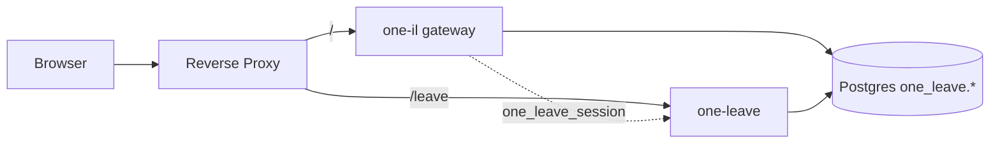

# ONE-IL Gateway architecture

`one-il` is the **gateway / portal** for the ONE-IL platform: a thin identity hub + app
launcher. Business modules (leave, assets, room booking, organization, employees, etc.)
live in their own repositories (e.g. `one-leave`) and share the same Supabase project.

Decisions in effect for this milestone:

- **Separate git repos** per system (`one-il`, `one-leave`, ...).
- **Path-based deployment** behind one reverse proxy (same origin).
- **per-app-login**: login UI lives in **one-leave** (`/leave/login`); gateway redirects there.
- **Identity core**: `one_leave.users`, `one_leave.user_roles`, `one_leave.employees` (Postgres via `DATABASE_URL`).
- **copy-now-extract-later**: shared code is duplicated per repo for now; extract to `one-shared` later.

## What the gateway owns

| Area | Location |
|------|----------|
| Auth entry (redirect → one-leave login) | `src/routes/(auth)/login/` → `/leave/login` |
| Session | Cookie `one_leave_session` (HMAC, `SESSION_SECRET` shared with one-leave) |
| Auth implementation | `src/lib/server/one-leave/*` |
| App launcher (home) | `src/routes/(app)/+page.svelte` (renders `navigation.homeNavCards`) |
| App launcher (waffle menu) | `src/lib/components/apps-menu.svelte` |
| Profile / settings | `src/routes/(app)/settings/` |
| User change request | `src/routes/(app)/account/change-request/` |
| Role center | `src/routes/(app)/roles/` |
| Menu catalog admin | `src/routes/(app)/menu-catalog/` |
| Central RBAC catalog | `src/lib/auth/roles.ts` (all apps' permission keys) |
| DB-driven menu | tables `menu_groups`, `menu_items` — seed: `pnpm db:seed:menu-catalog` (`20260601140000_gateway_menu_catalog_seed.sql`) |

The gateway knows about **every** app's permission keys and menu entries so it can show the
right tiles per role. Each menu item's `href` is just a path string — point it at an external
app (e.g. `/leave`) and the reverse proxy routes it there.

## SSO = same-origin cookie

Gateway and one-leave share the **`one_leave_session`** cookie (`path: "/"`, same `SESSION_SECRET`).
Log in once at `/leave/login`; both `/` (gateway) and `/leave/*` see the same session.

Optional: Supabase Auth paths remain in `(auth)/` for legacy/dev if `PUBLIC_SUPABASE_*` is configured.

Zero-trust rule: every app re-validates the session in its own `hooks.server.ts` and enforces RLS.



Required env for gateway auth: `DATABASE_URL`, `SESSION_SECRET` (same values as one-leave).

## Local dev (two terminals)

`pnpm dev` ที่ one-il อย่างเดียวจะทำให้ `/leave/login` วน redirect ได้ (gateway ส่งต่อ path ที่ one-leave ต้องรับ)

```bash
# Terminal A — one-leave (พอร์ต 5174)
cd one-leave/apps/web
pnpm dev --port 5174

# Terminal B — gateway (พอร์ต 5173, proxy /leave → 5174)
cd one-il
pnpm dev
```

`vite.config.ts` proxy `/leave` → `http://127.0.0.1:5174` และตัด prefix ออก (`/leave/login` → `/login` ที่แอปลา).

ถ้าพอร์ต 5173 ถูกใช้แล้ว: `VITE_PORT=5175 pnpm dev` หรือปิด process เดิม (`netstat -ano | findstr :5173` บน Windows).

## Reverse proxy mapping (example: Caddy)

```caddy
app.example.com {
    handle_path /leave/* {
        reverse_proxy 127.0.0.1:3001   # one-leave (adapter-node)
    }
    handle {
        reverse_proxy 127.0.0.1:3000   # one-il gateway (adapter-node)
    }
}
```

nginx equivalent:

```nginx
location /leave/ { proxy_pass http://127.0.0.1:3001/; }
location /       { proxy_pass http://127.0.0.1:3000/; }
```

## Sub-app base path

Each non-root app must be served under its own base path so its own asset/route URLs resolve
behind the proxy. In the sub-app's `svelte.config.js`:

```js
// one-leave/svelte.config.js
const config = {
    kit: {
        paths: { base: process.env.NODE_ENV === "production" ? "/leave" : "" },
    },
};
```

The gateway itself stays at base `""`. Launcher links use `${base}${href}`, so a menu item with
`href = "/leave"` works from the gateway, and internal links keep working inside each app.

## Shared canon (future `one-shared` extraction)

These files are the duplicated-by-design canon. When ready, extract them into a shared
submodule/package and have every app consume the same copy:

- `src/hooks.server.ts` — Supabase SSR client + auth guard
- `src/lib/server/auth.ts` — `loadSessionUser`, session types
- `src/lib/server/oauth.ts`, `src/lib/server/supabase-admin.ts`
- `src/lib/auth/roles.ts` — roles + permission keys (the platform RBAC contract)
- `src/app.css` — Tailwind v4 theme tokens (the design-system tokens, tweakcn-tuned)
- `src/lib/components/ui/*` — shadcn-svelte primitives
- `src/lib/i18n/*`, `src/lib/content/labels.ts` — locale + shared labels

DB types (`src/lib/database.types.ts`) are **not** shared — each repo regenerates them from the
single source of truth (the Supabase schema) via `pnpm supabase:types`.
