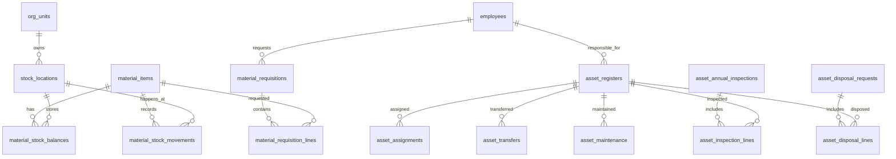

### Project asset module (วัสดุและครุภัณฑ์)

โมดูลพัสดุและครุภัณฑ์สำหรับ ONE-IL รองรับงานคณะของมหาวิทยาลัยไทย โดยยึดแนวทางราชการ เช่น ระเบียบกระทรวงการคลังว่าด้วยการจัดซื้อจัดจ้างและการบริหารพัสดุภาครัฐ พ.ศ. 2560, แนวปฏิบัติกรมบัญชีกลาง, และ workflow มหาวิทยาลัยเรื่องทะเบียนคุม บัญชีวัสดุ ตรวจนับประจำปี และการจำหน่ายพัสดุ

## Goals

- ทำบัญชีวัสดุและทะเบียนคุมครุภัณฑ์ให้ตรวจสอบย้อนหลังได้
- ลดงาน Excel แยกไฟล์ของเจ้าหน้าที่พัสดุและผู้รับผิดชอบครุภัณฑ์
- รองรับการเบิกวัสดุ รับเข้า จ่ายออก และ stock card แบบไม่ให้ยอดติดลบ
- รองรับทะเบียนครุภัณฑ์พร้อมผู้รับผิดชอบ สถานที่ สถานะ ประวัติโอนย้าย และเอกสาร
- เตรียมข้อมูลสำหรับตรวจนับประจำปี รายงานผู้บริหาร และการตรวจสอบภายใน

## Scope

### วัสดุ

- Master data รายการวัสดุ หมวดวัสดุ หน่วยนับ และคลัง/สถานที่เก็บ
- รับวัสดุเข้าคลังจากการจัดซื้อ ตรวจรับ โอนเข้า คืนของ หรือยกยอด
- ใบเบิกวัสดุพร้อมรายการขอเบิก จำนวนอนุมัติ และจำนวนจ่ายจริง
- Stock ledger แบบ append-only เพื่อทำ stock card และ audit trail
- รายงานยอดคงเหลือ วัสดุใกล้หมด และประวัติรับ-จ่ายรายรายการ

### ครุภัณฑ์

- ทะเบียนคุมครุภัณฑ์พร้อมเลขครุภัณฑ์ไม่ซ้ำ หมวด รายละเอียด ราคา วันที่รับ แหล่งงบประมาณ และ serial/model
- ผู้รับผิดชอบ หน่วยงาน สถานที่ตั้ง และประวัติการเปลี่ยนแปลง
- โอนย้าย/เปลี่ยนผู้รับผิดชอบ/เปลี่ยนสถานที่
- แจ้งซ่อมและบันทึกประวัติซ่อมบำรุง
- ตรวจนับประจำปีและผลตรวจรายครุภัณฑ์
- จำหน่าย โอน แปรสภาพ ทำลาย หรือจำหน่ายเป็นสูญ พร้อมเหตุผล คณะกรรมการ เอกสาร และผลอนุมัติ

## Out of Scope for Phase 1

- เชื่อม e-GP หรือระบบจัดซื้อจัดจ้างเต็มรูปแบบ
- คำนวณบัญชีและค่าเสื่อมราคาแบบสมบูรณ์
- Workflow คณะกรรมการแบบ dynamic ซับซ้อนหลายชุด
- Mobile barcode/QR scanner จริง

## Users and Permissions

| Role | Main permissions | Description |
| --- | --- | --- |
| ผู้ใช้ทั่วไป | `supply:request`, `asset:view` | ขอเบิกวัสดุและดูครุภัณฑ์ที่เกี่ยวข้องกับตนเอง |
| เจ้าหน้าที่พัสดุ | `supply:manage`, `asset:manage` | ดูแลรายการวัสดุ รับเข้า จ่ายออก ทะเบียนครุภัณฑ์ และเอกสาร |
| กรรมการตรวจนับ | `asset:inspect` | บันทึกผลตรวจนับและข้อเสนอแนะ |
| ผู้มีอำนาจจำหน่าย | `asset:dispose` | พิจารณา/บันทึกกระบวนการจำหน่าย |
| ผู้ดูแลระบบ | all | จัดการสิทธิ์และข้อมูลทั้งหมด |

## Core Data Model

## Workflow Summary

### เบิกวัสดุ

1. ผู้ใช้สร้างใบเบิกและระบุหน่วยงาน/วัตถุประสงค์
2. ผู้มีอำนาจหรือเจ้าหน้าที่พัสดุตรวจสอบและอนุมัติจำนวน
3. เจ้าหน้าที่พัสดุจ่ายวัสดุ ระบบสร้าง `material_stock_movements` และปรับยอดคงเหลือ
4. ใบเบิกเปลี่ยนสถานะเป็นจ่ายแล้วหรือจ่ายบางส่วน

### รับวัสดุเข้าคลัง

1. เจ้าหน้าที่พัสดุบันทึกการรับเข้า อ้างเลขเอกสารหรือใบตรวจรับ
2. ระบบสร้าง movement ประเภทรับเข้า
3. ระบบปรับ `material_stock_balances` และบันทึก audit event

### ทะเบียนครุภัณฑ์

1. เจ้าหน้าที่พัสดุสร้างทะเบียนครุภัณฑ์จากรายการตรวจรับหรือข้อมูลเริ่มต้น
2. ระบุเลขครุภัณฑ์ หมวด รายละเอียด ผู้รับผิดชอบ หน่วยงาน และสถานที่
3. ระบบสร้าง assignment ปัจจุบันและ audit event
4. ทุกการโอนย้าย/เปลี่ยนสถานะต้องสร้างประวัติ ไม่แก้สถานะลอย ๆ

### ตรวจนับและจำหน่าย

1. สร้างรอบตรวจนับประจำปีพร้อม snapshot รายการครุภัณฑ์
2. กรรมการตรวจนับบันทึกพบ/ไม่พบ สภาพ และข้อเสนอแนะ
3. รายการหมดความจำเป็นหรือชำรุดเข้าสู่คำขอจำหน่าย
4. บันทึกวิธีจำหน่าย เช่น ขาย โอน แปรสภาพ ทำลาย หรือจำหน่ายเป็นสูญ

## Business Rules

- Stock balance ห้ามติดลบจากการจ่ายปกติ
- Movement และ audit event เป็น append-only สำหรับตรวจสอบย้อนหลัง
- เลขครุภัณฑ์ต้อง unique และไม่ควร reuse แม้จำหน่ายแล้ว
- Lookup และข้อความจาก DB ต้องมีคู่ภาษาไทย/อังกฤษตามมาตรฐาน `label_th`/`label_en` หรือ `name`/`name_en`
- การจำหน่ายต้องมีเหตุผล วิธีการ เอกสาร และผู้บันทึกครบ
- การตรวจนับประจำปีต้อง snapshot รายการ ณ วันเริ่มรอบ

## Implementation Notes

- ใช้ SvelteKit server-side load/actions เท่านั้นสำหรับ DB writes
- Validate form ด้วย Zod ทุก action
- ใช้ `assertPermission` ก่อนเข้าหน้าหรือ action สำคัญ
- ใช้ Supabase RLS ทุกตารางใน `public`
- ใช้ `org_units`, `employees`, `employee_assignments` เป็น source of truth สำหรับหน่วยงานและบุคลากร
- ใช้ `localizedLookupLabel` และ `localizedDualField` สำหรับ UI สองภาษา
